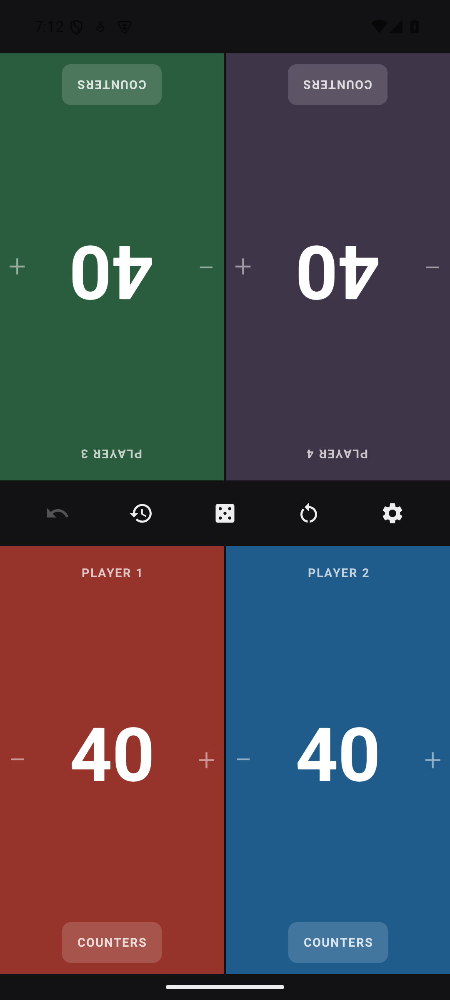
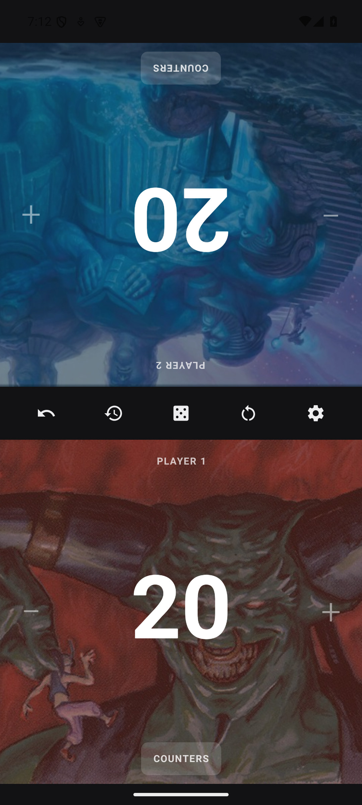

# Life Tracker

A Magic: The Gathering life tracker for two players or a four-player Commander table.

No ads. No accounts. No analytics. No "premium" tier. No network permission, so it
could not phone home even if it wanted to.

<p align="center">
  
  
</p>

<p align="center">
  
  
  
</p>

## What it does

- **1v1 or four-player Commander**, selected in Settings. Commander starts four players
  at 40 life in a 2×2 layout; 1v1 starts at 20. The upper panels rotate 180° to face
  the opposite seats. Changing mode starts a new game and can be undone.
- **Tap either side of your half** to change your life: left removes one, right adds one.
  The whole half is the button, so you are not aiming at a small target mid-combat.
- **Hold to repeat**, accelerating — a twelve-point swing is one press, not twelve taps.
- **Burst totalling.** Taps within two seconds add up and show as a floating `+3` / `−5`
  next to your total, and land in the log as *one* entry rather than five.
- **Counters:** poison, energy, experience and rad, in a drawer inside your own half
  that stays the right way up for you and leaves your opponent's side working.
- **Loss conditions shown, never enforced.** Zero life or ten poison drains the colour
  out of that half and marks it. Life can come back, so nothing is ever blocked.
- **Undo**, one log entry at a time.
- **Game history** — every change, newest first, with who and how much.
- **Dice and coin** — d20, coin flip, and a random first player. The result is shown
  once, at a size that carries across the table, and shrinks to fit whatever it has to
  say. A 6 or a 9 is underlined, so it cannot be read as the other one from the far seat.
- **New game** behind a confirmation that says exactly what it will clear.
- **Starting life** 20, 40, 25, or anything you type.
- **Names and colours** per player, in the five Magic colours plus multicolour.
- **Ten card-art backgrounds for 1v1.** Tap a player name, choose an illustration and
  adjust its intensity with a live preview, then Save. Each player chooses independently.
  Solid colour is always available. Art is hidden in Commander and restored when returning
  to 1v1. All images are bundled, so no download or permission is needed on the phone.
- **Keeps the screen awake**, so the display never sleeps mid-turn.
- **Survives being killed.** The game is saved as you play; force-quit and reopen mid-match
  and both totals, counters and history are exactly where you left them.
- Light and dark themes, haptics, and full TalkBack labelling.

## Install it

Download **[nobs-mtg-lifetracker-1.1.apk](dist/nobs-mtg-lifetracker-1.1.apk)**
(2.1 MB) straight onto your phone and tap it.

Android will say it came from an unknown source, because it did not come from the Play
Store. It asks once for permission to install from whatever app you downloaded it with —
your browser or file manager — and that permission is per-app and revocable afterwards:
*Settings > Apps > Special app access > Install unknown apps*.

Needs Android 8.0 (API 26) or newer. Nothing else — no account, and no network permission,
so it works fine in aeroplane mode forever.

To update later, download the newer APK and install it over the top; your game is kept.

<details>
<summary>Checking you got the real thing</summary>

The APK is signed with a key that never leaves the maintainer's machine, so any build
carrying this signature was built from it:

```bash
$ANDROID_HOME/build-tools/35.0.0/apksigner verify --print-certs nobs-mtg-lifetracker-1.1.apk
```

```
Signer #1 certificate DN: CN=NoBullshit MTG LifeTracker, OU=ZegDatHetKan, O=ZegDatHetKan
Signer #1 certificate SHA-256 digest: 2ec276fc7eb62ddc4ccbf0b1e34ec11354615a0288b7aa8dfac0e451e22d559b
```

And the file itself:

```
SHA-256  82a9f71c53eb35de3e79d01b5399feabaa1a111fa8b584aae45e023e2b1adaef
```

</details>

## The "no bullshit" part is checkable

The claim is structural, not a promise in a privacy policy. `AndroidManifest.xml`
declares no `<uses-permission>` of any kind. You can verify it against the built APK:

```bash
$ANDROID_HOME/build-tools/35.0.0/aapt2 dump permissions app/build/outputs/apk/debug/app-debug.apk
```

```
package: com.nobs.mtglifetracker
permission: com.nobs.mtglifetracker.DYNAMIC_RECEIVER_NOT_EXPORTED_PERMISSION
uses-permission: name='com.nobs.mtglifetracker.DYNAMIC_RECEIVER_NOT_EXPORTED_PERMISSION'
```

That single entry is one the app defines **for itself**: AndroidX adds it so its own
runtime broadcast receivers are not exported to other apps. It grants no access to
anything. Note what is absent — there is no `INTERNET` permission, so the process cannot
open a socket. There are no third-party SDKs either; the dependencies are AndroidX,
Compose, and kotlinx.serialization.

## Build it

Needs a JDK 17 and the Android SDK (platform 35). Gradle arrives via the wrapper.

```bash
git clone git@github.com:ZegDatHetKan/NoBullshit_MTG_LifeTracker.git
cd NoBullshit_MTG_LifeTracker
echo "sdk.dir=$HOME/Android/Sdk" > local.properties   # or let Android Studio write it

./gradlew assembleDebug        # -> app/build/outputs/apk/debug/app-debug.apk
./gradlew testDebugUnitTest    # rules tests
```

For a release build (minified and resource-shrunk):

```bash
./gradlew assembleRelease      # -> app/build/outputs/apk/release/app-release.apk
```

No signing key lives in this repository, and none ever should. Without one that command
still assembles a release build, just unsigned — which Android will refuse to install. To
sign your own, drop a `keystore.properties` next to `settings.gradle.kts`:

```properties
storeFile=/absolute/path/to/your.jks
storePassword=...
keyAlias=...
keyPassword=...
```

Gradle picks it up automatically, and the file is git-ignored.

Install it on a plugged-in phone with USB debugging on:

```bash
adb install -r app/build/outputs/apk/debug/app-debug.apk
```

Or open the folder in Android Studio and press Run.

Minimum Android 8.0 (API 26). Portrait only — it is meant to lie flat on a table
between players.

## How it is put together

Single module, no architecture ceremony.

```
model/GameState.kt     Immutable data classes; a game is one value.
model/GameReducer.kt   Every rule, as pure functions. This is what the tests cover.
data/GameRepository.kt DataStore persistence. Local, and the only storage there is.
ui/GameViewModel.kt    Holds the state, the undo stack and the save debounce.
ui/GameScreen.kt       Opposed halves or a 2×2 table, with shared centre controls.
ui/PlayerPanel.kt      One player's half: tap zones, life, burst bubble, counters.
ui/*Dialog.kt          History, dice, settings, new game, player name and colour.
```

Because `GameState` is an immutable value and `GameReducer` is pure, undo is just a
stack of previous states — no command objects, no inverse operations to keep in sync.
A snapshot is pushed whenever a change opens a *new* log entry, which is what keeps
"one undo" and "one line of history" meaning the same thing.

The rules have unit tests (`app/src/test/`) covering life going negative, the burst
merge window, bursts that cancel to zero, poison at nine versus ten, and what a new
game does and does not clear.

## Licence

Source code: MIT — see [LICENSE](LICENSE). Card illustrations are not covered by the
MIT licence; they belong to Wizards of the Coast and their respective artists.
See [artwork credits and sources](docs/artwork.md).
