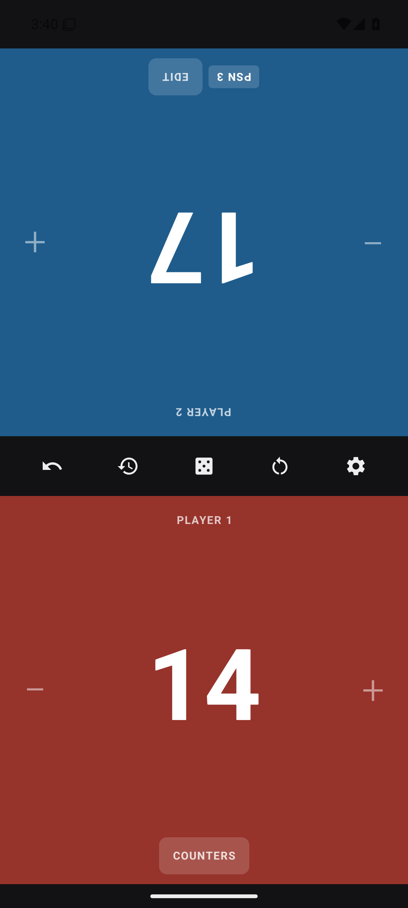
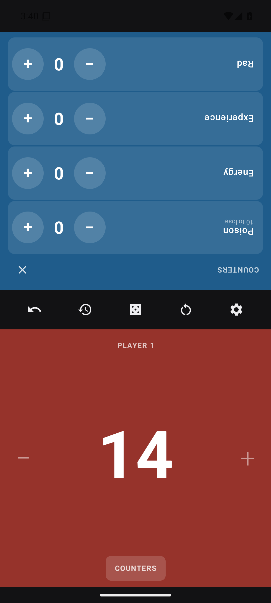
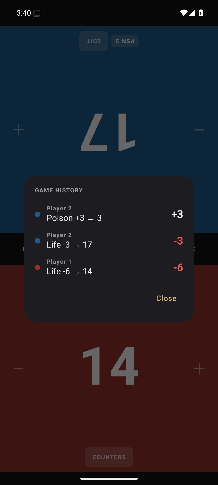

# Life Tracker

A Magic: The Gathering life tracker for two players. It does the standard job every
tracker on the store does — and nothing else.

No ads. No accounts. No analytics. No "premium" tier. No network permission, so it
could not phone home even if it wanted to.

<p align="center">
  
  
  
</p>

## What it does

- **Two life totals**, one per half of the screen. The opponent's half is rotated 180°
  so it reads the right way up from across the table.
- **Tap either side of your half** to change your life: left removes one, right adds one.
  The whole half is the button, so you are not aiming at a small target mid-combat.
- **Hold to repeat**, accelerating — a twelve-point swing is one press, not twelve taps.
- **Burst totalling.** Taps within two seconds add up and show as a floating `+3` / `−5`
  next to your total, and land in the log as *one* entry rather than five.
- **Counters:** poison, energy, experience and rad, in a drawer inside your own half
  that stays the right way up for you and leaves your opponent's side working.
- **Loss conditions shown, never enforced.** Zero life or ten poison drains the colour
  out of that half and marks it. Life can come back, so nothing is ever blocked.
- **Undo**, one log entry at a time.
- **Game history** — every change, newest first, with who and how much.
- **Dice and coin** — d20, coin flip, and a random first player. The result is drawn
  twice, once flipped, so both players read it without leaning over the table.
- **New game** behind a confirmation that says exactly what it will clear.
- **Starting life** 20, 40, 25, or anything you type.
- **Names and colours** per player, in the five Magic colours plus multicolour.
- **Keeps the screen awake**, so the display never sleeps mid-turn.
- **Survives being killed.** The game is saved as you play; force-quit and reopen mid-match
  and both totals, counters and history are exactly where you left them.
- Light and dark themes, haptics, and full TalkBack labelling.

## The "no bullshit" part is checkable

The claim is structural, not a promise in a privacy policy. `AndroidManifest.xml`
declares no `<uses-permission>` of any kind. You can verify it against the built APK:

```bash
$ANDROID_HOME/build-tools/35.0.0/aapt2 dump permissions app/build/outputs/apk/debug/app-debug.apk
```

```
package: com.nobs.mtglifetracker
permission: com.nobs.mtglifetracker.DYNAMIC_RECEIVER_NOT_EXPORTED_PERMISSION
uses-permission: name='com.nobs.mtglifetracker.DYNAMIC_RECEIVER_NOT_EXPORTED_PERMISSION'
```

That single entry is one the app defines **for itself**: AndroidX adds it so its own
runtime broadcast receivers are not exported to other apps. It grants no access to
anything. Note what is absent — there is no `INTERNET` permission, so the process cannot
open a socket. There are no third-party SDKs either; the dependencies are AndroidX,
Compose, and kotlinx.serialization.

## Build it

Needs a JDK 17 and the Android SDK (platform 35). Gradle arrives via the wrapper.

```bash
git clone git@github.com:ZegDatHetKan/MTG_LifeTracker.git
cd MTG_LifeTracker
echo "sdk.dir=$HOME/Android/Sdk" > local.properties   # or let Android Studio write it

./gradlew assembleDebug        # -> app/build/outputs/apk/debug/app-debug.apk
./gradlew testDebugUnitTest    # rules tests
```

Install it on a plugged-in phone with USB debugging on:

```bash
adb install -r app/build/outputs/apk/debug/app-debug.apk
```

Or open the folder in Android Studio and press Run.

Minimum Android 8.0 (API 26). Portrait only — it is meant to lie flat on a table
between two people.

## How it is put together

Single module, no architecture ceremony.

```
model/GameState.kt     Immutable data classes; a game is one value.
model/GameReducer.kt   Every rule, as pure functions. This is what the tests cover.
data/GameRepository.kt DataStore persistence. Local, and the only storage there is.
ui/GameViewModel.kt    Holds the state, the undo stack and the save debounce.
ui/GameScreen.kt       Two opposed halves and the centre bar between them.
ui/PlayerPanel.kt      One player's half: tap zones, life, burst bubble, counters.
ui/*Dialog.kt          History, dice, settings, new game, player name and colour.
```

Because `GameState` is an immutable value and `GameReducer` is pure, undo is just a
stack of previous states — no command objects, no inverse operations to keep in sync.
A snapshot is pushed whenever a change opens a *new* log entry, which is what keeps
"one undo" and "one line of history" meaning the same thing.

The rules have unit tests (`app/src/test/`) covering life going negative, the burst
merge window, bursts that cancel to zero, poison at nine versus ten, and what a new
game does and does not clear.

## Licence

MIT — see [LICENSE](LICENSE).
